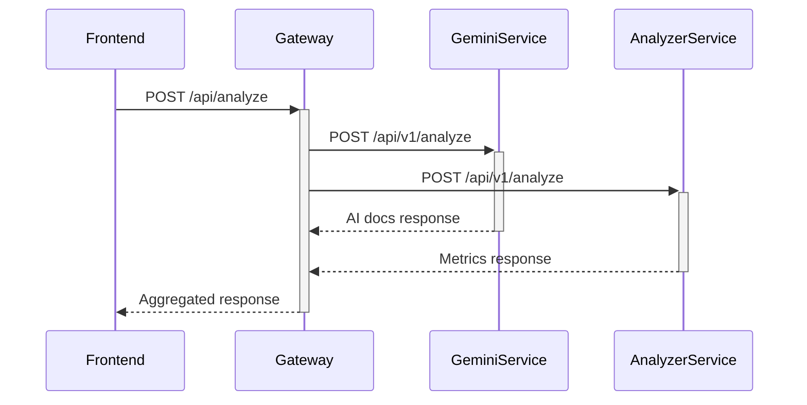
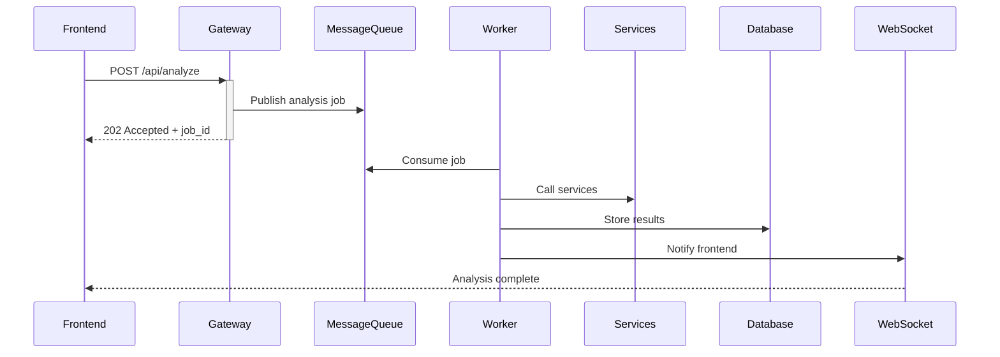
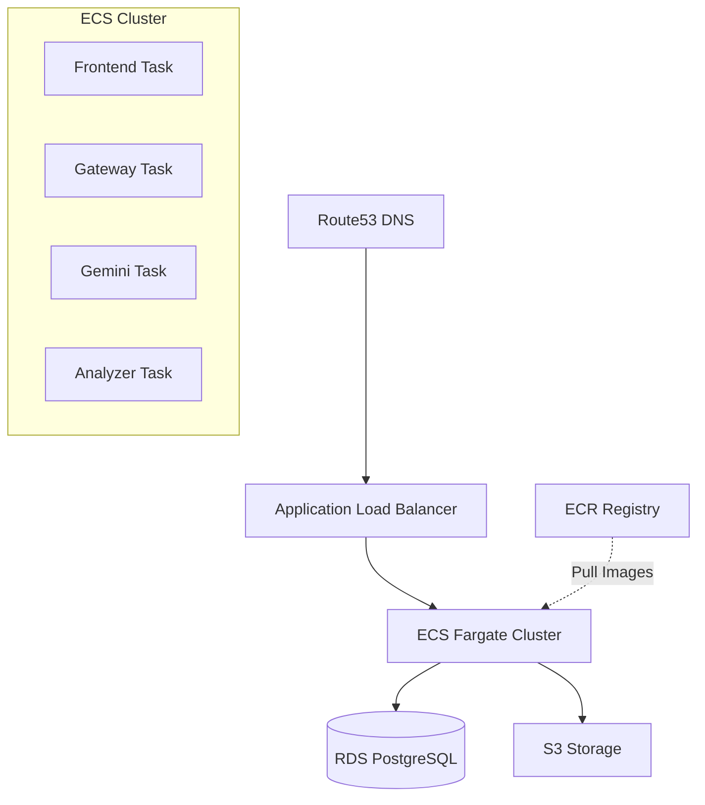
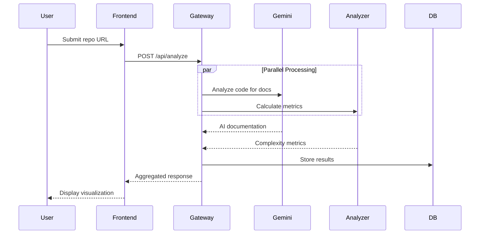

# Architecture Documentation

## System Design Overview

The AI Code Visualizer Platform follows a microservices architecture with clear service boundaries and responsibilities. This document explains the architectural decisions, communication patterns, and integration strategies.

---

## Core Architectural Principles

### 1. **Microservices Architecture**
- **Service Independence**: Each service can be developed, deployed, and scaled independently
- **Technology Diversity**: Services use optimal tech stacks (Python for AI, Java for concurrency, TypeScript for UI)
- **Bounded Contexts**: Clear responsibility boundaries between services

### 2. **API Gateway Pattern**
- **Single Entry Point**: All client requests route through the gateway
- **Request Orchestration**: Gateway aggregates responses from multiple services
- **Cross-Cutting Concerns**: Authentication, rate limiting, logging centralized

### 3. **Event-Driven Communication**
- **Async Processing**: Long-running analysis tasks processed asynchronously
- **Service Decoupling**: Services communicate via events, not direct calls
- **Scalability**: Enables horizontal scaling of individual services

---

## Service Breakdown

### Frontend (React + TypeScript)
**Responsibility**: User interface and visualization  
**Technology**: React 18, TypeScript, Vite, Axios  
**Port**: 3000

**Key Features:**
- Repository input form with validation
- Real-time analysis progress tracking
- Interactive visualization of metrics
- Responsive design for mobile/desktop

**Communication:**
- REST API calls to API Gateway at `/api/analyze`
- WebSocket connection for real-time updates (future)

---

### API Gateway (FastAPI)
**Responsibility**: Request routing and service orchestration  
**Technology**: Python FastAPI, httpx, asyncio  
**Port**: 8000

**Key Features:**
- Parallel service invocation with `asyncio.gather()`
- Response aggregation from multiple services
- Health check aggregation for all services
- CORS middleware for frontend access

**Endpoints:**
```
POST /api/analyze          - Orchestrates full analysis
GET  /api/services/status  - Health check all services
GET  /health               - Gateway health
```

**Communication Pattern:**
```python
async def analyze():
    results = await asyncio.gather(
        call_gemini_service(),
        call_analyzer_service()
    )
    return aggregate_results(results)
```

---

### Generative AI Service (Python FastAPI)
**Responsibility**: AI-powered code documentation  
**Technology**: Python FastAPI, Google Gemini AI API  
**Port**: 8001

**Integration:**
- Receives code snippets from API Gateway
- Calls Google Gemini API with structured prompts
- Returns natural language documentation
- Caches responses to reduce API calls

**See:** `../generative-ai-python-service/` for implementation

---

### Concurrent Analyzer Service (Java Spring Boot)
**Responsibility**: High-performance parallel code analysis  
**Technology**: Java 21, Spring Boot, ExecutorService  
**Port**: 8080

**Integration:**
- Receives file lists from API Gateway
- Spawns thread pool for parallel analysis
- Calculates complexity metrics (LOC, cyclomatic complexity)
- Returns aggregated metrics with performance stats

**See:** `../java-concurrent-analyzer-api/` for implementation

---

### PostgreSQL Database
**Responsibility**: Persistent storage for analysis results  
**Technology**: PostgreSQL 16  
**Port**: 5432

**Schema Design:**
```sql
-- analyses table
CREATE TABLE analyses (
    id UUID PRIMARY KEY,
    repository_url TEXT NOT NULL,
    branch VARCHAR(100),
    status VARCHAR(20),
    created_at TIMESTAMP,
    completed_at TIMESTAMP
);

-- analysis_results table
CREATE TABLE analysis_results (
    id UUID PRIMARY KEY,
    analysis_id UUID REFERENCES analyses(id),
    ai_documentation TEXT,
    complexity_metrics JSONB,
    patterns TEXT[]
);
```

---

## Communication Patterns

### 1. **Request-Response (Synchronous)**


**Use Case:** Real-time analysis with immediate response  
**Advantage:** Simple, predictable flow  
**Limitation:** Client waits for slowest service

---

### 2. **Asynchronous Processing (Future Enhancement)**


**Use Case:** Long-running analyses (1000+ files)  
**Advantage:** Non-blocking, better UX  
**Implementation:** Redis queue + WebSocket notifications

---

## Infrastructure Layer

### Local Development (Docker Compose)
```yaml
services:
  - frontend (React)
  - api-gateway (Python)
  - gemini-service (Python)
  - analyzer-service (Java)
  - postgres (Database)
```

**Network:** Bridge network `platform-network`  
**Data Persistence:** Named volume `postgres-data`

---

### Production Deployment (AWS)


**Provisioned by:** `terraform-aws-iac-provisioner` repository

**Resources:**
- **VPC**: 10.0.0.0/16 with public/private subnets
- **ECS Fargate**: Serverless container orchestration
- **RDS PostgreSQL**: Managed database
- **ALB**: HTTPS termination and routing
- **S3**: Static asset storage
- **ECR**: Container image registry

---

## Security Considerations

### 1. **Network Security**
- Private subnets for backend services
- Security groups restricting inter-service communication
- ALB for public-facing HTTPS endpoints

### 2. **Authentication (Future)**
- JWT tokens issued by API Gateway
- OAuth2 integration with GitHub
- Service-to-service authentication via mTLS

### 3. **Secrets Management**
- Environment variables for API keys
- AWS Secrets Manager in production
- No secrets in source code or Docker images

---

## Scalability Strategy

### Horizontal Scaling
| Service | Scaling Metric | Target |
|---------|---------------|--------|
| Frontend | ALB connections | 100 RPS |
| Gateway | CPU utilization | 70% |
| Gemini Service | Request queue | <50 |
| Analyzer Service | Thread pool saturation | 80% |

### Vertical Scaling
- **Gateway**: 2 vCPU, 4GB RAM
- **Gemini**: 2 vCPU, 4GB RAM
- **Analyzer**: 4 vCPU, 8GB RAM (thread-heavy)

---

## Monitoring & Observability

### Health Checks
- Liveness: `/health` endpoint on all services
- Readiness: Database connectivity + dependency checks
- Interval: 30s, Timeout: 10s, Retries: 3

### Metrics (Future)
- **Prometheus**: Service metrics scraping
- **Grafana**: Dashboard visualization
- **Jaeger**: Distributed tracing

### Logging
- **Structured Logging**: JSON format with correlation IDs
- **Centralized**: CloudWatch Logs or ELK stack
- **Levels**: ERROR, WARN, INFO, DEBUG

---

## Future Enhancements

### 1. **Message Queue Integration**
- Replace synchronous gateway calls with RabbitMQ/SQS
- Enable true async processing
- Retry logic for failed jobs

### 2. **Caching Layer**
- Redis for frequently analyzed repositories
- TTL: 1 hour for analysis results
- Cache invalidation on repo updates

### 3. **Service Mesh**
- Istio for traffic management
- Circuit breaker patterns
- Canary deployments

### 4. **Real-Time Updates**
- WebSocket connections for live progress
- Server-Sent Events (SSE) alternative
- Progress bars during long analyses

---

## Technology Choices Rationale

| Decision | Reason |
|----------|--------|
| **FastAPI for Gateway** | Async support, automatic OpenAPI docs, Python ecosystem |
| **Java for Analyzer** | Superior concurrency primitives (ExecutorService, CompletableFuture) |
| **React for Frontend** | Component reusability, large ecosystem, TypeScript support |
| **PostgreSQL** | ACID compliance, JSONB for flexible schema, proven reliability |
| **Docker Compose** | Simple local development, matches production container setup |

---

## Diagram: Complete Request Flow



---

**Questions?** See [IMPLEMENTATION_ROADMAP.md](IMPLEMENTATION_ROADMAP.md) for learning path.
