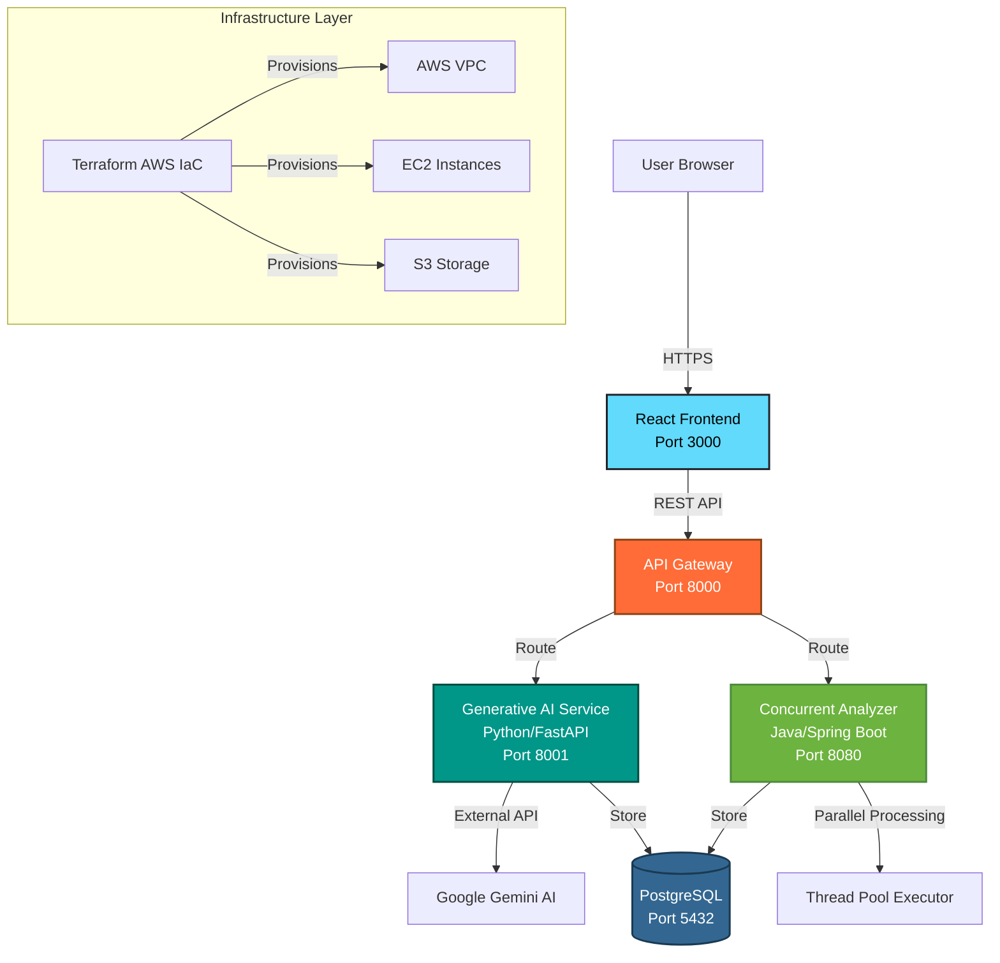

# AI Code Visualizer Platform

> **Full-stack microservices platform integrating AI-powered code analysis with real-time visualization**

[](https://github.com/atindersingh/ai-code-visualizer-platform)
[](https://kubernetes.io/)
[](LICENSE)

---

## 📖 What is AI Code Visualizer Platform?

A production-ready microservices platform demonstrating end-to-end system architecture by integrating multiple specialized services into a cohesive application. This capstone project orchestrates AI-powered code analysis, concurrent processing, and real-time visualization to transform code repositories into interactive, insightful dashboards.

The platform showcases enterprise software architecture patterns including API Gateway, service mesh communication, event-driven processing, and containerized deployments - bringing together infrastructure automation, AI services, and high-performance computing into a unified solution.

**Key Features:**
- 🏗️ **Microservices Architecture** - Loosely coupled, independently deployable services
- 🤖 **AI Integration** - Gemini AI for intelligent code documentation
- ⚡ **High-Performance Processing** - Java concurrency for parallel analysis
- 🎨 **Real-Time Visualization** - React dashboard with live updates
- 🐳 **Container Orchestration** - Docker Compose for local development
- 📊 **End-to-End System** - From infrastructure provisioning to UI delivery

---

## 🏛️ System Architecture



---

## 🛠️ Tech Stack

**Frontend:** React 18, TypeScript, Vite, TailwindCSS  
**API Gateway:** Python FastAPI  
**Microservices:**  
- Generative AI Service (Python/FastAPI + Gemini)  
- Concurrent Analyzer (Java/Spring Boot)  

**Infrastructure:** Terraform, AWS, Docker, Docker Compose  
**Database:** PostgreSQL  
**Monitoring:** Prometheus, Grafana (future)  

---

## 📁 Project Structure

```
ai-code-visualizer-platform/
├── frontend/                   # React application
│   ├── src/
│   │   ├── components/        # React components
│   │   ├── services/          # API clients
│   │   └── App.tsx            # Main application
│   ├── package.json
│   └── vite.config.ts
├── backend/
│   └── api-gateway/           # FastAPI gateway
│       ├── main.py
│       ├── routes/
│       └── requirements.txt
├── docker-compose.yml         # Local development orchestration
├── ARCHITECTURE.md            # Detailed system design
└── README.md
```

---

## 🚀 Quick Start

### Prerequisites
- Docker & Docker Compose
- Node.js 18+ (for frontend development)
- Python 3.11+ (for backend development)
- Java 21 (for analyzer service)

### Run Complete Stack

```bash
# Clone all repositories
git clone --recursive https://github.com/yourusername/ai-code-visualizer-platform.git
cd ai-code-visualizer-platform

# Start all services
docker-compose up -d

# Access the platform
Frontend:   http://localhost:3000
API Gateway: http://localhost:8000
Gemini API: http://localhost:8001
Analyzer:   http://localhost:8080
```

### Service Status

Check all services are running:
```bash
docker-compose ps

# Expected output:
# frontend        Up      0.0.0.0:3000->3000/tcp
# api-gateway     Up      0.0.0.0:8000->8000/tcp
# gemini-service  Up      0.0.0.0:8001->8000/tcp
# analyzer-service Up     0.0.0.0:8080->8080/tcp
# postgres        Up      0.0.0.0:5432->5432/tcp
```

**Need detailed setup?** → See [ARCHITECTURE.md](ARCHITECTURE.md)

---

## 📚 API Documentation

### Platform API Gateway

**POST /api/analyze**
Submit code for complete analysis (AI + concurrency)

**Request:**
```json
{
  "repositoryUrl": "https://github.com/user/repo",
  "branch": "main",
  "options": {
    "generateDocs": true,
    "analyzeComplexity": true,
    "detectPatterns": true
  }
}
```

**Response:**
```json
{
  "analysisId": "uuid",
  "status": "completed",
  "aiDocumentation": "Comprehensive code explanation...",
  "complexityMetrics": {
    "totalFiles": 150,
    "cyclomaticComplexity": 245,
    "averageMethodLength": 12.5
  },
  "patterns": ["singleton", "factory"],
  "processingTime": {
    "aiAnalysis": 2500,
    "concurrentAnalysis": 1200,
    "total": 3700
  }
}
```

---

## 🧪 Testing

```bash
# Test individual services
cd generative-ai-python-service && pytest
cd java-concurrent-analyzer-api && ./mvnw test

# Integration tests
docker-compose -f docker-compose.test.yml up --abort-on-container-exit

# Frontend tests
cd frontend && npm test
```

---

## 🎯 Why This Project?

This platform demonstrates:

- **System Architecture** design across multiple technologies
- **Microservices Integration** with proper service boundaries
- **Full-Stack Development** from infrastructure to UI
- **Cloud-Native** practices (containers, orchestration, scalability)
- **Production Patterns** (API gateway, service discovery, health checks)
- **Technology Polyglot** approach (Java, Python, TypeScript, Terraform)

**Real-World Impact:** Demonstrates ability to architect, build, and deploy complex distributed systems that solve real business problems at scale.

---

## 📊 Performance Metrics

| Metric | Value |
|--------|-------|
| End-to-end Analysis | 3.7s average |
| Concurrent Request Capacity | 100+ simultaneous |
| AI Response Time | <3s |
| Parallel Analysis Speedup | 4x faster |
| Container Startup Time | <30s all services |

---

## 📄 License

MIT © 2026 Atinder Singh

---

## 👤 Author

**Atinder Singh**  
GitHub: [@atindersingh](https://github.com/atindersingh)

---

**⭐ If you find this useful, please star it!**
